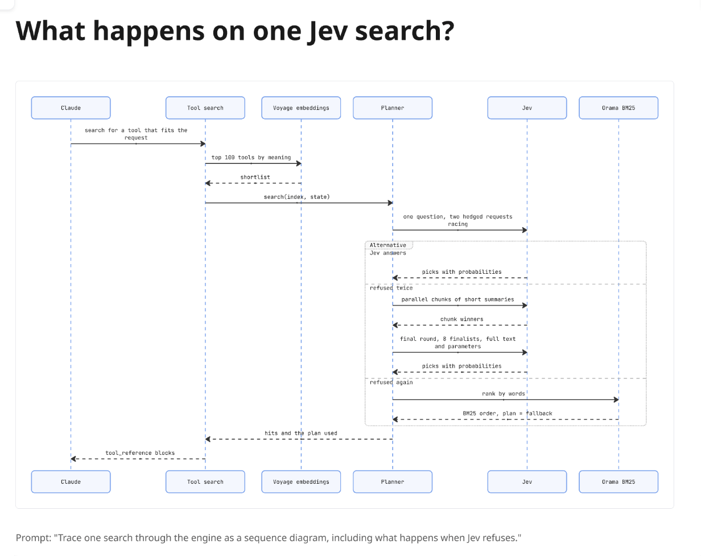
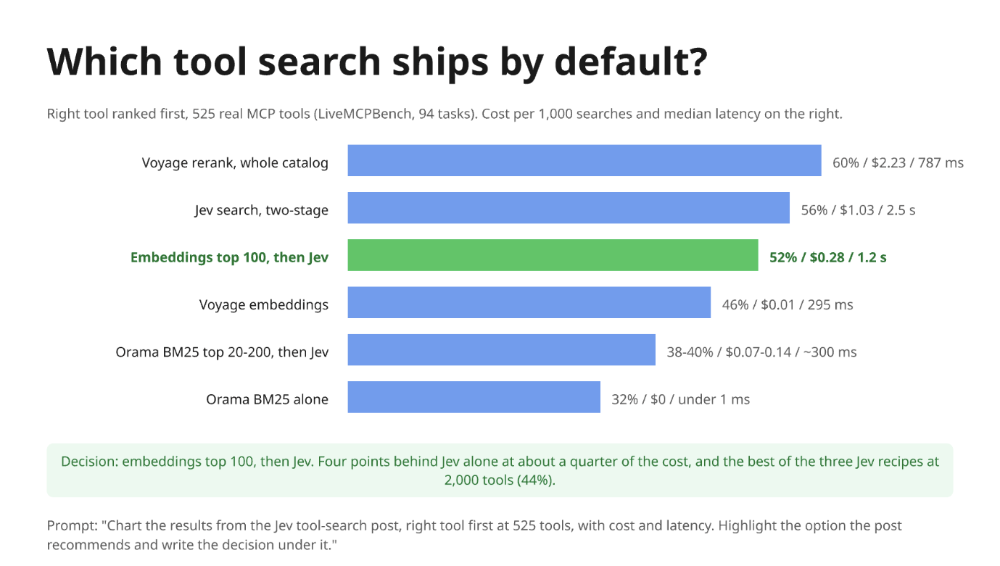

# Miro agent skills

Five skills that make a coding agent **draw its work** on a Miro board through the
[Miro MCP](https://miro.com/ai/mcp/): what a session did, how a system fits together, how one flow
runs, what a change did, and which option a decision picked.

They come from the article
**[Agents should draw their work. Miro MCP lets them.](https://kachar.dev/blog/agents-draw-their-work-with-miro-mcp)**,
which shows each one with a real example.

## Install

With [skills.sh](https://skills.sh), for Claude Code, Codex, Cursor and other agents:

```bash
npx skills add kachar/miro-agent-skills
```

One skill only:

```bash
npx skills add kachar/miro-agent-skills --skill miro-change-map
```

Or copy a folder from [`skills/`](skills) into `~/.claude/skills/` (Claude Code) or
`~/.agents/skills/` (Codex).

## Connect the Miro MCP first

The skills call Miro's canvas tools, so the agent needs the Miro MCP server:

```bash
# Claude Code
claude mcp add --transport http miro https://mcp.miro.com/

# Codex (opens the Miro sign-in page)
codex mcp add miro --url https://mcp.miro.com/
```

Miro keeps one MCP connection per user, and every tool call counts toward a daily limit
(100 on Free, 500 on Starter, 2,000 on Business, 10,000 on Enterprise, as of September 2026).

## The skills

| Skill | Draws | Ask for it with |
|---|---|---|
| [`miro-session-map`](skills/miro-session-map/SKILL.md) | What the agent just did, as a flowchart with decision gates | "map this session" |
| [`miro-system-map`](skills/miro-system-map/SKILL.md) | How a codebase fits together, as a block diagram | "draw the current setup" |
| [`miro-flow-trace`](skills/miro-flow-trace/SKILL.md) | One request or job through the code, as a sequence diagram | "what happens when..." |
| [`miro-change-map`](skills/miro-change-map/SKILL.md) | What a change did, as before and after | "show me before and after" |
| [`miro-decision-chart`](skills/miro-decision-chart/SKILL.md) | The numbers behind a decision, with the pick highlighted | "chart these results" |

## What each skill draws

The examples below were drawn by Claude Code through the Miro MCP. Four of them map the
open-source [Jev tool search](https://github.com/kachar/jev-tool-search); the first maps the session
that wrote the article.

### `miro-session-map`

What the agent just did: steps, parallel branches, decision gates and where it ended.


Prompt: *"Draw how this article is being made as a left-to-right flowchart. Mark the decision gates."*

```bash
npx skills add kachar/miro-agent-skills --skill miro-session-map
```

### `miro-system-map`

How a codebase fits together: what runs where, what calls what, and every arrow that writes data.


Prompt: *"Read kachar/jev-tool-search and draw how a tool search flows through it, plus the harness that tunes it. Label every arrow."*

```bash
npx skills add kachar/miro-agent-skills --skill miro-system-map
```

### `miro-flow-trace`

One request or job through the code, as a sequence diagram with its branches and failure paths.



Prompt: *"Trace one search through the engine as a sequence diagram, including what happens when Jev refuses."*

```bash
npx skills add kachar/miro-agent-skills --skill miro-flow-trace
```

### `miro-change-map`

What a change did, as before and after: added in green, removed or broken in orange, reworked in blue.


Prompt: *"Draw how the search changed after the LiveMCPBench run, before and after."*

```bash
npx skills add kachar/miro-agent-skills --skill miro-change-map
```

### `miro-decision-chart`

The numbers behind a hard call, with the chosen option highlighted and the decision written underneath.



Prompt: *"Chart the results from the Jev tool-search post, right tool first at 525 tools, with cost and latency. Highlight the option the post recommends and write the decision under it."*

```bash
npx skills add kachar/miro-agent-skills --skill miro-decision-chart
```

## Two rules every skill follows

Every skill follows the same two rules: every number comes from a command or a file, and every
arrow points to a line of code. A picture that breaks them is a nicer-looking hallucination.

Maps of your own production systems list every endpoint, login path and data store. Keep those
boards private to your team.

## License

MIT
